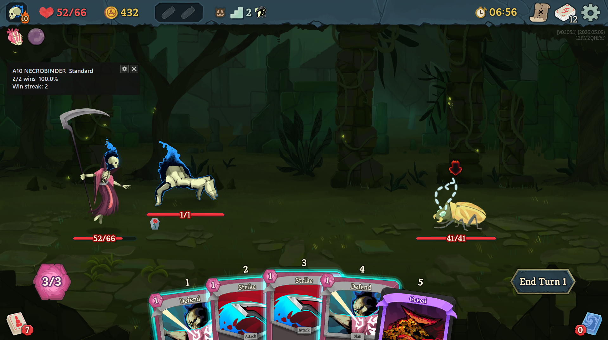

# StS2 Win Rate Overlay

Slay the Spire 2 のラン履歴から、勝率と現在の連勝数を表示する Windows 用オーバーレイアプリです。

特定のキャラクター、アセンション、日付範囲などでランを絞り込み、その条件での勝率と現在の連勝数を表示できます。

## 起動方法

以下のリンクから zip ファイルをダウンロードしてください。

[v1.0.0 をダウンロード](https://github.com/pmhk2156/StS2WinRateOverlay/releases/tag/v1.0.0)

zip ファイルを展開して、次の exe を起動してください。

`StS2WinRateOverlay.exe`

初回起動後、オーバーレイ右上の設定ボタンから設定画面を開き、`Directory` の `...` ボタンを押して、Slay the Spire 2 の `(プロファイル番号)\saves\history` フォルダを選択してください。

通常は次の場所を選択してください。

`C:\Program Files (x86)\Steam\userdata\(SteamのユーザーID)\2868840\remote\(プロファイル番号)\saves\history`

## 使用方法

設定ボタンから、集計対象のランをフィルターできます。

- Directory: `...` ボタンから `saves\history` フォルダを選択
- Ascension: `All` または `0` から `10` の数字を選択
- Character: `All`, `IRONCLAD`, `SILENT`, `REGENT`, `NECROBINDER`, `DEFECT` から選択
- App version: チェックを入れて、`0.105.1` のようにバージョン番号を入力
- Date range: チェックを入れて、開始日時と終了日時を指定
- Game mode: `Include all game modes` をオフにすると、Singleplayer-Standard のランのみを集計

表示 UI はドラッグで移動できます。移動した位置は保存され、次回起動時に復元されます。

---

StS2 Win Rate Overlay is a Windows overlay app that displays your win rate and current win streak from Slay the Spire 2 run history.

You can filter runs by character, ascension, date range, app version, and game mode. The overlay then shows the win rate and current win streak for the selected runs.

## Run

Download the zip file from the link below:

[Download v1.0.0](https://github.com/pmhk2156/StS2WinRateOverlay/releases/tag/v1.0.0)

Unzip the release archive and run:

`StS2WinRateOverlay.exe`

After launching the app for the first time, open the settings window from the button in the upper-right of the overlay. Press the `...` button next to `Directory`, then select your Slay the Spire 2 `(profile)\saves\history` folder.

Usually, the folder is:

`C:\Program Files (x86)\Steam\userdata\(Steam user ID)\2868840\remote\(profile)\saves\history`

## Usage

Use the settings button to choose which runs are counted.

- Directory: press `...` and select the `saves\history` folder
- Ascension: select `All` or a number from `0` to `10`
- Character: select `All`, `IRONCLAD`, `SILENT`, `REGENT`, `NECROBINDER`, or `DEFECT`
- App version: check it, then enter a version such as `0.105.1`
- Date range: check it, then select the start and end date/time
- Game mode: if `Include all game modes` is unchecked, only Singleplayer-Standard runs are counted

The overlay can be moved by dragging it. Its position is saved and restored on the next launch.
